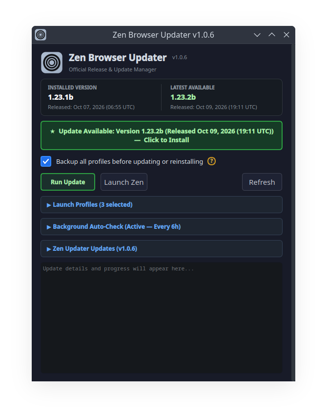
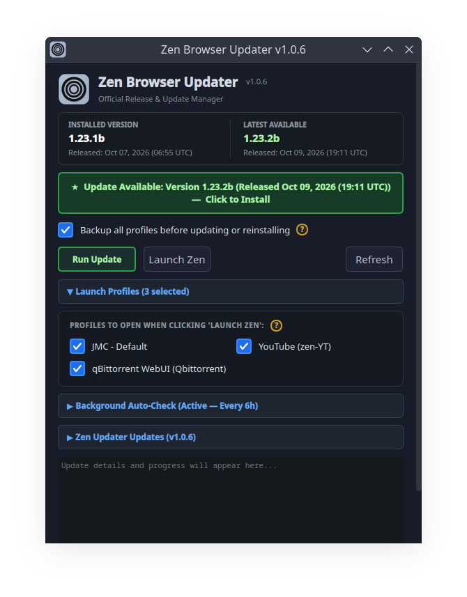
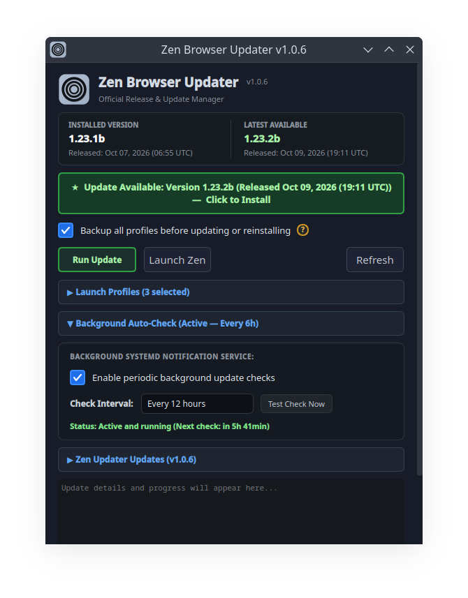
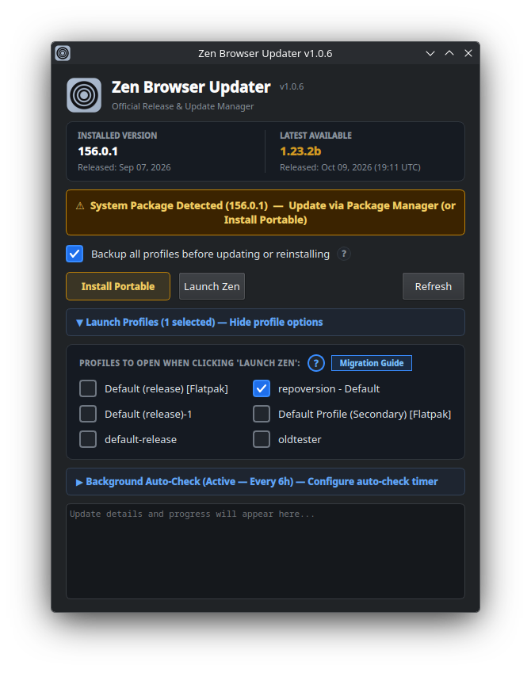
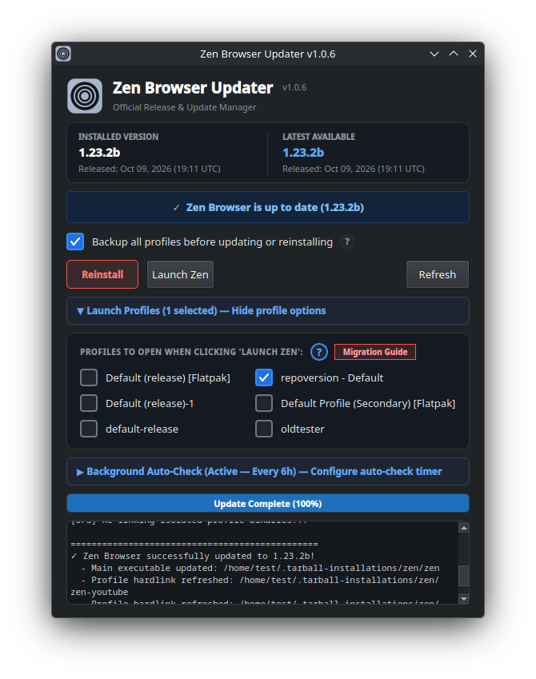
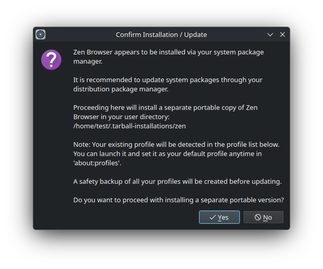

# Zen Browser Updater & Background Notification Service

A native desktop update manager, profile launcher, and background notification service for Zen Browser on Linux.

### Application Overview

<p align="center">
  
</p>

| Expanded Sections | Self-Updater & Timer |
| :---: | :---: |
|  |  |

### Repository & Package Detection

<p align="center">
  
</p>

| Flatpak & Migration Notice | External Profile Launch Safeguards |
| :---: | :---: |
|  |  |

---

## Overview

Zen Browser on Linux is frequently distributed as an official portable tarball, but users may also install it via system package managers (DNF, APT, Pacman) or Flatpak. This repository provides an end-to-end management suite:

1. **Zen Updater GUI (`zen_updater_gui.py`)**: A native PyQt6 desktop application to inspect releases, create safety snapshots, apply updates, manage system/flatpak profile migration, and launch multi-profile browser workflows.
2. **Safe Update Engine (`update_zen.sh`)**: A bash script that gracefully closes running instances, snapshots profile databases, fetches official release tarballs directly from GitHub, and restores custom profile binary hardlinks.
3. **Background Update Checker (`check_zen_update.sh`)**: A lightweight background monitor triggered by systemd that queries GitHub releases, sends non-intrusive desktop notifications when updates are available, and tracks notification IDs to prevent notification spam.

---

## Features

- **Direct GitHub Releases Tracking**: Queries GitHub's official release endpoint directly to obtain authoritative version metadata without API rate limits.
- **Side-by-Side Version Card**: Immediate visual comparison of the currently installed version against the latest available release, including release dates.
- **Installation Type Detection & Safeguards**:
  - Automatically identifies whether Zen Browser is installed as a **portable tarball**, **system repository package**, or **Flatpak**.
  - If installed via repository package manager, informs the user and provides a safe opt-in mechanism to install a parallel portable version.
- **Pre-Update Profile Safety Snapshot**: Automatically archives `~/.zen` using multi-threaded `zstd` compression prior to updating, while intelligently excluding volatile browser caches (`cache2`, `startupCache`, remote settings, disposable site icon caches, and crash logs) to keep snapshots fast and lightweight (~300 MB). Automatically maintains a rolling 2-backup rotation in `~/.zen-backups/`.
- **Multi-Profile Launching & Flatpak Profile Migration**:
  - Dynamically discovers all configured profiles across both portable registries (`~/.zen/profiles.ini`) and Flatpak / system registries (`~/.var/app/io.github.zen_browser.zen/data/zen/`).
  - Automatically flags external profiles with `[Flatpak]` badges and displays an interactive **Migration Guide** with step-by-step instructions.
  - Passes `--allow-downgrade` and appropriate profile flags so portable Zen can safely load existing Flatpak profiles without database locks or version schema warnings.
  - Integrates with dedicated desktop launchers (`.desktop` files) for custom isolated web apps.
  - Launches selected profiles with a 250ms stagger to prevent Wayland/X11 socket collisions.
- **Accordion Navigation & Smooth Scroll Container**:
  - Features single-section expansion (accordion behavior) so opening one card cleanly collapses others.
  - Wrapped inside a custom dark-styled `QScrollArea` with locked scrollbar tracking to eliminate horizontal content shifting across screen resolutions and DPI scaling.
- **Integrated Systemd Background Timer Management**:
  - Configure, enable, or disable periodic background update checks directly in the GUI without touching a terminal.
  - Set custom intervals: **Every 4 hours**, **Every 12 hours**, **Daily (Every 24 hours - Default)**, or **Weekly (Every 7 days)**.
  - Live timer status reporting with countdown to the next scheduled check.
  - On-demand notification verification via the "Test Check Now" button.
- **Desktop Notification Integration & Auto-Dismissal**:
  - Background checks issue desktop notifications via `notify-send`.
  - Opening the Updater GUI or running an update sends a DBus `CloseNotification` signal, immediately clearing stale alerts from your notification center.
- **Isolated Profile Binary Re-linking**:
  - After unpacking new Zen binaries, the engine dynamically discovers and refreshes binary hardlinks (such as `zen-youtube` or `qbittorrent-webui`), preserving taskbar pins, application classes, and custom dock icons.
- **Zen Updater Self-Updater**:
  - Dedicated expandable card to inspect and install updates to the updater itself directly from GitHub Releases.
  - Optional automatic startup check (disabled by default) that displays a prominent update badge in the header next to the title.
  - 4-second timeout with completely silent fallback so network latency never stalls the interface.
  - One-click update with seamless in-place restart via `os.execv`.
- **Fully Portable Across Any Linux Setup**:
  - No hardcoded usernames, home directories, or distro-specific paths.
  - Dedicated custom Ice Steel application icon for Zen Updater.
  - Dynamically self-locates companion scripts regardless of where the repository is cloned.

---

## System Requirements

- **Linux Distribution**: Any modern Linux desktop (Nobara, Fedora, Arch, Ubuntu, Debian, openSUSE, etc.)
- **Python**: Python 3.9+ with `PyQt6`
- **Shell Utilities**: `bash`, `curl`, `tar`, `zstd`, `pgrep`, `pkill`
- **Notification Daemon**: Any FreeDesktop-compliant notification daemon (`notify-send`, `dbus`)
- **Systemd**: For automated user-level background checks

---

## Installation

### Method 1: Automated Installer

Clone the repository and run the included installer:

```bash
git clone https://github.com/PlasmaDrifter/Zen.updater.gui.git
cd Zen.updater.gui
chmod +x install.sh
./install.sh
```

The installer will:
1. Copy scripts to `~/.local/bin/` and create the `zen-updater` symlink.
2. Install the desktop entry to `~/.local/share/applications/zen-updater.desktop` with the dedicated Ice Steel icon.
3. Install and activate the systemd user service and background timer (default: daily).

### Method 2: Manual Installation

1. Install Python dependencies:
   ```bash
   pip install PyQt6
   # Or using your system package manager:
   # sudo dnf install python3-pyqt6
   # sudo apt install python3-pyqt6
   # sudo pacman -S python-pyqt6
   ```

2. Make scripts executable:
   ```bash
   chmod +x zen_updater_gui.py update_zen.sh check_zen_update.sh update_updater.sh
   ```

3. Copy the desktop entry:
   ```bash
   mkdir -p ~/.local/share/applications ~/.local/share/icons
   cp assets/icon.png ~/.local/share/icons/zen-updater.png
   cp zen-updater.desktop ~/.local/share/applications/
   sed -i "s|Exec=zen_updater_gui.py|Exec=${HOME}/.local/bin/zen_updater_gui.py|g" ~/.local/share/applications/zen-updater.desktop
   update-desktop-database ~/.local/share/applications
   ```

4. Enable the background check timer:
   ```bash
   mkdir -p ~/.config/systemd/user
   cp systemd/zen-update-check.service ~/.config/systemd/user/
   cp systemd/zen-update-check.timer ~/.config/systemd/user/
   systemctl --user daemon-reload
   systemctl --user enable --now zen-update-check.timer
   ```

---

## Usage

### 1. Launching the GUI

You can start the updater from your application launcher under **Zen Browser Updater**, or from a terminal:

```bash
zen-updater
# Or directly:
python3 zen_updater_gui.py
```

- Click **Refresh** to manually check for the latest release.
- Click **Run Update** to close running browser processes, create a profile safety snapshot, and install the latest tarball.
- Click **Launch Zen** to launch your default profile and all checked secondary profiles.
- Click **Launch Profiles** to expand the profile selection grid and manage profile migration. Profile choices persist in `~/.config/zen-updater/settings.json`.
- Click **Background Auto-Check** to expand the timer settings card. Toggle background checks on/off, choose how frequently to check (4h, 12h, Daily, Weekly), view live timer countdown status, or click **Test Check Now** to verify notifications immediately.
- Click **Zen Updater Updates** to check for and apply updates to the Zen Updater application itself.

### 2. Running the Update Engine Standalone (CLI)

The core updater can be executed without the GUI in scripts or terminal sessions:

```bash
./update_zen.sh
```

Flags:
- `--force` or `-f`: Reinstall or refresh current version even if already up to date.
- `--no-backup`: Skip pre-update profile backup.
- `--backup`: Explicitly enforce safety backup (enabled by default).
- `--install-dir <path>`: Specify target installation directory.

### 3. Background Notification Service

The background timer checks for updates daily (every 24 hours by default) and 5 minutes after system boot:

- View timer status:
  ```bash
  systemctl --user status zen-update-check.timer
  ```
- View service execution log:
  ```bash
  journalctl --user -u zen-update-check.service -n 50 --no-pager
  ```
- Trigger an immediate manual test run:
  ```bash
  systemctl --user start zen-update-check.service
  ```

---

## Profile Management & Migration

When installing the portable version of Zen Browser on a system that previously ran a Flatpak or Linux distribution package, Zen creates a fresh profile registry for the portable binary. The Updater GUI automatically detects all existing profiles across installations.

### Setting Your Previous Profile as Default

1. **Launch the Profile**: In the Zen Updater GUI, expand **Launch Profiles**, check your existing profile (e.g. `Default Profile [Flatpak]`), and click **Launch Zen**.
2. **Open Profile Manager**: In the Zen address bar, navigate to `about:profiles`.
3. **Set as Default**: Find your preferred profile in the list and click **Set as default profile**.
4. Zen will now open directly into your profile whenever launched from desktop shortcuts or application menus.

---

## Configuration & File Locations

| File | Purpose |
| :--- | :--- |
| `~/.tarball-installations/zen` | Default installation directory for Zen Browser |
| `~/.zen` | Firefox/Zen profile registry and user data |
| `~/.zen-backups` | Safety snapshots generated prior to updates |
| `~/.config/zen-updater/settings.json` | Persistent user preferences for launch profiles and updater check setting |
| `~/.cache/zen_update_notification_id` | Tracks notification ID for clean DBus dismissal |

---

## License

This project is licensed under the MIT License. See [LICENSE](LICENSE) for details.

---

## Community & Discussions

Got questions, setup ideas, or feedback?

* Join our subreddit at [**r/PlasmaDrifterProjects**](https://reddit.com/r/PlasmaDrifterProjects) to discuss updates, get support, and share configurations.
* Contact directly via email at [**plasmadrifter121@gmail.com**](mailto:plasmadrifter121@gmail.com).
