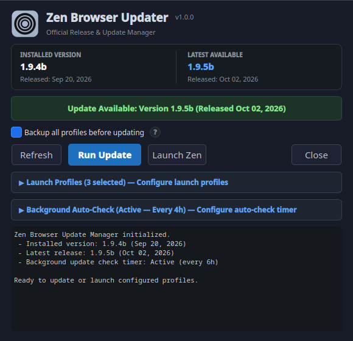
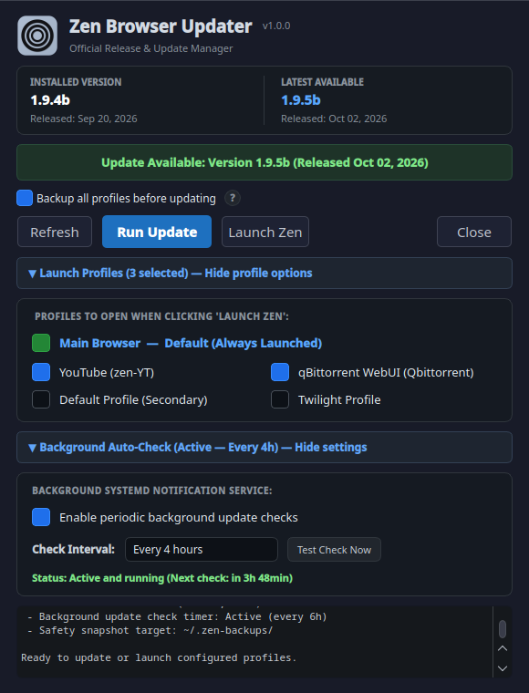

# Zen Browser Updater & Background Notification Service

A desktop update manager, profile launcher, and background notification service for Zen Browser on Linux.

### Default View


### Expanded Controls (Launch Profiles & Background Auto-Check)


---

## Overview

Zen Browser on Linux is frequently distributed as an official portable tarball rather than an auto-updating repository package. This repository provides an end-to-end management suite:

1. **Zen Updater GUI (`zen_updater_gui.py`)**: A native PyQt6 desktop application to inspect releases, create safety snapshots, apply updates, and launch multi-profile browser workflows.
2. **Safe Update Engine (`update_zen.sh`)**: A bash script that gracefully closes running instances, snapshots profile databases, fetches official release tarballs directly from GitHub, and restores custom profile binary hardlinks.
3. **Background Update Checker (`check_zen_update.sh`)**: A lightweight background monitor triggered by systemd that queries GitHub releases, sends non-intrusive desktop notifications when updates are available, and tracks notification IDs to prevent notification spam.

---

## Features

- **Direct GitHub Releases Tracking**: Queries GitHub's official release endpoint directly to obtain authoritative version metadata without API rate limits.
- **Side-by-Side Version Card**: Immediate visual comparison of the currently installed version against the latest available release, including release dates.
- **Pre-Update Profile Safety Snapshot**: Automatically archives `~/.zen` using multi-threaded `zstd` compression prior to updating, while excluding volatile browser caches (`cache2`, `startupCache`). Automatically maintains a rolling 2-backup rotation in `~/.zen-backups/`.
- **Multi-Profile Launching with Staggered Windows**:
  - Dynamically discovers all configured profiles from `~/.zen/profiles.ini`.
  - Integrates with dedicated desktop launchers (`.desktop` files) for custom isolated web apps.
  - Falls back cleanly to standard CLI flags (`zen --no-remote -P "<Profile>"`) on vanilla machines.
  - Automatically activates the default profile and lets you toggle secondary profiles in a 2-column grid.
  - Launches selected profiles with a 250ms stagger to prevent Wayland/X11 socket collisions.
- **Integrated Systemd Background Timer Management**:
  - Configure, enable, or disable periodic background update checks directly in the GUI without touching a terminal.
  - Set custom intervals (Every 2h, 4h, 6h, 12h, or 24h daily).
  - Live timer status reporting with countdown to the next scheduled check.
  - On-demand notification verification via the "Test Check Now" button.
- **Desktop Notification Integration & Auto-Dismissal**:
  - Background checks issue desktop notifications via `notify-send`.
  - Opening the Updater GUI or running an update sends a DBus `CloseNotification` signal, immediately clearing stale alerts from your notification center.
- **Isolated Profile Binary Re-linking**:
  - After unpacking new Zen binaries, the engine dynamically discovers and refreshes binary hardlinks (such as `zen-youtube` or `qbittorrent-webui`), preserving taskbar pins, application classes, and custom dock icons.
- **Fully Portable Across Any Linux Setup**:
  - No hardcoded usernames, home directories, or distro-specific paths.
  - Cascading icon fallback (custom icons -> official bundled Zen icons -> system theme icons).
  - Dynamically self-locates companion scripts regardless of where the repository is cloned.

---

## System Requirements

- **Linux Distribution**: Any modern Linux desktop (Nobara, Fedora, Arch, Ubuntu, Debian, openSUSE, etc.)
- **Python**: Python 3.9+ with `PyQt6`
- **Shell Utilities**: `bash`, `curl`, `tar`, `zstd`, `pgrep`, `pkill`
- **Notification Daemon**: Any FreeDesktop-compliant notification daemon (`notify-send`, `dbus`)
- **Systemd**: For automated user-level background checks

---

## Installation

### Method 1: Automated Installer

Clone the repository and run the included installer:

```bash
git clone https://github.com/PlasmaDrifter/Zen.updater.gui.git
cd Zen.updater.gui
chmod +x install.sh
./install.sh
```

The installer will:
1. Copy scripts to `~/.local/bin/` and create the `zen-updater` symlink.
2. Install the desktop entry to `~/.local/share/applications/zen-updater.desktop`.
3. Install and activate the systemd user service and timer.

### Method 2: Manual Installation

1. Install Python dependencies:
   ```bash
   pip install PyQt6
   # Or using your system package manager:
   # sudo dnf install python3-pyqt6
   # sudo apt install python3-pyqt6
   # sudo pacman -S python-pyqt6
   ```

2. Make scripts executable:
   ```bash
   chmod +x zen_updater_gui.py update_zen.sh check_zen_update.sh
   ```

3. Copy the desktop entry:
   ```bash
   mkdir -p ~/.local/share/applications
   cp zen-updater.desktop ~/.local/share/applications/
   # Ensure Exec points to your script location:
   sed -i "s|Exec=zen_updater_gui.py|Exec=${HOME}/.local/bin/zen_updater_gui.py|g" ~/.local/share/applications/zen-updater.desktop
   update-desktop-database ~/.local/share/applications
   ```

4. Enable the background check timer:
   ```bash
   mkdir -p ~/.config/systemd/user
   cp systemd/zen-update-check.service ~/.config/systemd/user/
   cp systemd/zen-update-check.timer ~/.config/systemd/user/
   systemctl --user daemon-reload
   systemctl --user enable --now zen-update-check.timer
   ```

---

## Usage

### 1. Launching the GUI

You can start the updater from your application launcher under **Zen Browser Updater**, or from a terminal:

```bash
zen-updater
# Or directly:
python3 zen_updater_gui.py
```

- Click **Refresh** to manually check for the latest release.
- Click **Run Update** to close running browser processes, create a profile safety snapshot, and install the latest tarball.
- Click **Launch Zen** to launch your default profile and all checked secondary profiles.
- Click **Launch Profiles** to expand the profile selection grid. Profile choices persist in `~/.config/zen-updater/settings.json`.
- Click **Background Auto-Check** to expand the timer settings card. You can toggle background checks on/off, choose how frequently to check (2h, 4h, 6h, 12h, 24h), view live timer countdown status, or click **Test Check Now** to verify notifications immediately.

### 2. Running the Update Engine Standalone (CLI)

The core updater can be executed without the GUI in scripts or terminal sessions:

```bash
./update_zen.sh
```

Flags:
- `--force` or `-f`: Reinstall or refresh current version even if already up to date.
- `--no-backup`: Skip pre-update profile backup.
- `--backup`: Explicitly enforce safety backup (enabled by default).

### 3. Background Notification Service

The background timer checks for updates every 6 hours and 5 minutes after system boot:

- View timer status:
  ```bash
  systemctl --user status zen-update-check.timer
  ```
- View service execution log:
  ```bash
  journalctl --user -u zen-update-check.service -n 50 --no-pager
  ```
- Trigger an immediate manual test run:
  ```bash
  systemctl --user start zen-update-check.service
  ```

---

## Configuration & File Locations

| File | Purpose |
| :--- | :--- |
| `~/.tarball-installations/zen` | Default installation directory for Zen Browser |
| `~/.zen` | Firefox/Zen profile registry and user data |
| `~/.zen-backups` | Safety snapshots generated prior to updates |
| `~/.config/zen-updater/settings.json` | Persistent user preferences for launch profiles |
| `~/.cache/zen_update_notification_id` | Tracks notification ID for clean DBus dismissal |

---

## License

This project is licensed under the MIT License. See [LICENSE](LICENSE) for details.
